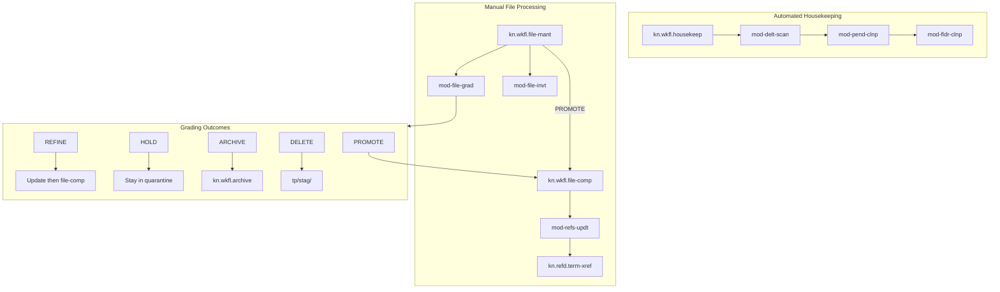

# Complete Housekeeping System

## Current State

The housekeeping system has these existing pieces:

**Workflows:**

- [kn.wkfl.00.01.19_file-mant.md](kv/Areas/kn/Govt/Workflows/kn.wkfl.00.01.19_file-mant.md) - Grading/routing (PROMOTE/REFINE/HOLD/ARCHIVE/DELETE)
- [kn.wkfl.00.01.19_file-comp.md](kv/Areas/kn/Govt/Workflows/kn.wkfl.00.01.19_file-comp.md) - File compliance (path/name/metadata)

**Modules (housekeeping-specific):**

- [kn.modl.00.01.19_file-grad.md](kv/Areas/kn/Govt/Modules/kn.modl.00.01.19_file-grad.md) - 4-axis grading + concept review
- [kn.modl.00.01.19_file-invt.md](kv/Areas/kn/Govt/Modules/kn.modl.00.01.19_file-invt.md) - File inventory
- [kn.modl.00.01.19_delt-scan.md](kv/Areas/kn/Govt/Modules/kn.modl.00.01.19_delt-scan.md) - Delta scan (modified files)
- [kn.modl.00.01.19_pend-clnp.md](kv/Areas/kn/Govt/Modules/kn.modl.00.01.19_pend-clnp.md) - Pending deletion cleanup
- [kn.modl.00.01.19_fldr-clnp.md](kv/Areas/kn/Govt/Modules/kn.modl.00.01.19_fldr-clnp.md) - Empty folder cleanup

**n8n Automation:**

- [proc-housekeep.json](kv/Areas/Automations/Workflows/proc-housekeep.json) - Automated: delt-scan -> pend-clnp -> fldr-clnp

**Missing (from 260204-1800 design):**

- Cross-reference sheet (term-xref)
- Reference update module (refs-updt)
- Updated file-comp workflow with cross-ref steps
- Formal housekeeping workflow document

---

## Part 1: Complete Cross-Reference System

### 1.1 Create Cross-Reference Sheet

**File:** `kv/Areas/kn/Govt/Reference/kn.refd.00.01.19_term-xref.md`

Structure (from 18:00 session design):

- Section 1: Terminology Mappings (short-form, long-form, hierarchy)
- Section 2: Filename Pattern Mappings
- Section 3: Path Mappings
- Section 4: Usage Notes

Initial mappings to include:

- CFP -> T1, PID -> T2, GKM -> T3
- Carry-Forward Pack -> T1_Session
- 30_Knowledge -> Areas/kn, 20_Areas -> Areas

### 1.2 Create refs-updt Module

**File:** `kv/Areas/kn/Govt/Modules/kn.modl.00.01.19_refs-updt.md`

Contract:

- INPUTS: file_path, xref_path, dry_run, sections
- OUTPUTS: changes_made, updated_content, change_count, success

Logic:

1. Load cross-ref sheet, parse into term_map, pattern_map, path_map
2. Read target file content
3. Replace LONG forms first, then short forms (avoid partial matches)
4. Replace paths last
5. Return change log

### 1.3 Update file-comp Workflow

**File:** `kv/Areas/kn/Govt/Workflows/kn.wkfl.00.01.19_file-comp.md`

Add three new steps to existing workflow:

```
STEP 0.5: Load cross-ref sheet (kn.refd.00.01.19_term-xref.md)
          → Parse into term_map, pattern_map, path_map
          → If not found: WARN, continue with empty maps

STEP 1.5: Cross-reference lookup (after STEP 1, before STEP 2)
          → Check current filename against pattern_map
          → If match: use new pattern for rename

STEP 4.5: Update internal references (after STEP 4, before STEP 5)
          → Call refs-updt module
          → Input: file_path = new location
          → Show proposed changes, get approval
```

Updated flow:

```
STEP 0.5: xref-load       → Load cross-ref sheet
STEP 1:   mod-taxo-path   → Resolve path
STEP 1.5: xref-lookup     → Check pattern mappings
STEP 2:   mod-taxo-name   → Build filename
STEP 3:   folder-create   → Create folders
STEP 4:   mod-file-move   → Move/create file
STEP 4.5: refs-updt       → Update internal references
STEP 5:   metadata        → Opus, built-in, frontmatter
STEP 6:   mod-proj-reg    → Registry
STEP 7:   mod-verf-rslt   → Verify
FINAL:    mod-user-conf   → Approval
```

---

## Part 2: Formalize Housekeeping Workflow

### 2.1 Create Housekeeping Workflow Document

**File:** `kv/Areas/kn/Govt/Workflows/kn.wkfl.00.01.19_housekeep.md`

This formalizes what the n8n `proc-housekeep.json` does as a governance document.

Purpose: Automated maintenance tasks that run periodically

Steps:

1. STEP 1: Delta Scan (mod-delt-scan) - Find modified files since last run
2. STEP 2: Pending Cleanup (mod-pend-clnp) - Delete expired staging folders
3. STEP 3: Folder Cleanup (mod-fldr-clnp) - Remove empty folders
4. STEP 4: Report Results (aggregate stats)

Trigger: n8n webhook or manual

Composition:

- References delt-scan, pend-clnp, fldr-clnp modules
- Mirrors the n8n workflow structure

### 2.2 Update Module Relations

Update frontmatter in these modules to reference the new housekeep workflow:

- [kn.modl.00.01.19_delt-scan.md](kv/Areas/kn/Govt/Modules/kn.modl.00.01.19_delt-scan.md) - Add `kn.wkfl.00.01.19_housekeep.md` to relations
- [kn.modl.00.01.19_pend-clnp.md](kv/Areas/kn/Govt/Modules/kn.modl.00.01.19_pend-clnp.md) - Add `kn.wkfl.00.01.19_housekeep.md` to relations
- [kn.modl.00.01.19_fldr-clnp.md](kv/Areas/kn/Govt/Modules/kn.modl.00.01.19_fldr-clnp.md) - Add `kn.wkfl.00.01.19_housekeep.md` to relations

### 2.3 Update file-comp Composition

Update `kn.wkfl.00.01.19_file-comp.md` frontmatter:

- Add refs-updt to children
- Add refs-updt to composition
- Update relations to include term-xref

---

## System Architecture After Completion




---

## Deliverables Summary


| Deliverable                   | Type      | Location                    |
| ----------------------------- | --------- | --------------------------- |
| kn.refd.00.01.19_term-xref.md | Reference | kv/Areas/kn/Govt/Reference/ |
| kn.modl.00.01.19_refs-updt.md | Module    | kv/Areas/kn/Govt/Modules/   |
| kn.wkfl.00.01.19_housekeep.md | Workflow  | kv/Areas/kn/Govt/Workflows/ |
| kn.wkfl.00.01.19_file-comp.md | Update    | kv/Areas/kn/Govt/Workflows/ |
| kn.modl.00.01.19_delt-scan.md | Update    | kv/Areas/kn/Govt/Modules/   |
| kn.modl.00.01.19_pend-clnp.md | Update    | kv/Areas/kn/Govt/Modules/   |
| kn.modl.00.01.19_fldr-clnp.md | Update    | kv/Areas/kn/Govt/Modules/   |


Total: 3 new files, 4 updates
